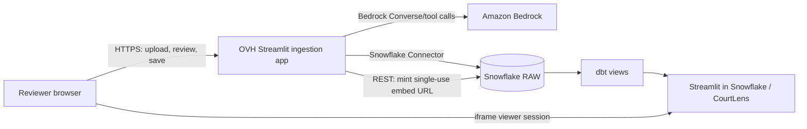
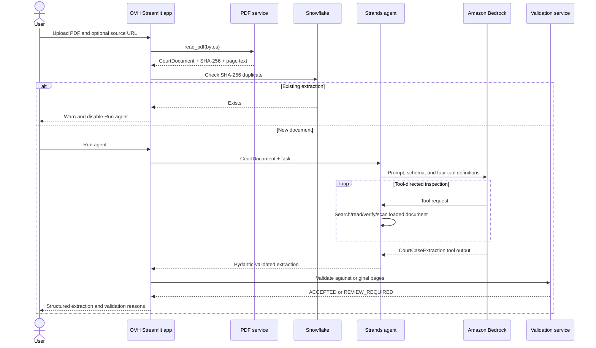

# NZ Court Intelligence — Technical Design

| Attribute | Value |
|---|---|
| Document status | As-built design with identified improvements |
| Last updated | 25 September 2026 |
| System | NZ Court Intelligence / CourtLens |
| Primary runtime | Python 3.12, Streamlit, Docker Compose |
| Data platform | Snowflake and dbt |
| AI runtime | Strands Agents SDK on Amazon Bedrock |

## 1. Purpose

NZ Court Intelligence processes publicly available New Zealand court judgment
PDFs into traceable structured case information. It combines model-assisted
extraction with deterministic verification, explicit human review, Snowflake
persistence, dbt analytics models, and a read-only CourtLens dashboard.

This document describes the current implementation, its security and runtime
boundaries, and the constraints that must be preserved when the system is
changed.

## 2. Scope

### 2.1 In scope

- Uploading one public judgment PDF through a browser.
- Extracting PDF text page by page.
- Using a constrained agent to extract court metadata, citations, legal topics,
  issues, outcomes, judges, and supporting evidence.
- Verifying citations and evidence against the uploaded document.
- Requiring a human acknowledgement before persistence.
- Preventing duplicate documents by SHA-256 digest.
- Storing raw structured results and validation details in Snowflake.
- Transforming raw records into analytics views with dbt.
- Presenting analytics through a Streamlit in Snowflake dashboard.
- Minting a short-lived dashboard embed URL and rendering it in a dialog.
- Deploying the ingestion application to an OVH host through GitHub Actions.

### 2.2 Out of scope

- Legal advice or automated legal decisions.
- Identifying anonymised or suppressed people.
- Deciding whether publication is legally permissible.
- OCR for scanned PDFs with no embedded text.
- Arbitrary web browsing, shell access, or SQL access by the agent.
- Multi-document batch ingestion through the main Streamlit application.
- End-user authentication and per-user authorization in the OVH application.
- Automatic deployment of the CourtLens dashboard into Snowflake.

## 3. Design goals

| Goal | Design response |
|---|---|
| Traceability | Extracted claims can include page-numbered evidence snippets. |
| Controlled AI behavior | The agent receives four document-specific tools only. |
| Deterministic quality checks | Application code rechecks references, evidence, and publication markers. |
| Human oversight | Saving is disabled until the user acknowledges review responsibility. |
| Reproducible analytics | Raw JSON is retained and transformed by version-controlled dbt models. |
| Least privilege | Model, writer, dbt, and dashboard responsibilities are separated. |
| Duplicate resistance | SHA-256 is the document identity and is checked before insertion. |
| Deployability | The ingestion service and dbt runner are separate Docker images. |

## 4. System context



There are two Streamlit applications:

1. The **ingestion application** in `app/` runs on OVH. It uploads, extracts,
   validates, reviews, and writes judgments.
2. The **CourtLens dashboard** in `dashboard/` runs inside Snowflake. It reads
   analytical views and does not write data.

The dashboard is rendered inside a modal dialog in the ingestion application,
but it remains a separate Snowflake-hosted application and browser session.

## 5. Component design

| Component | Responsibility | Important boundary |
|---|---|---|
| `app/main.py` | Streamlit workflow and session state | Orchestrates services; contains no extraction logic. |
| `app/config.py` | Environment-backed runtime settings | Secrets remain server-side. |
| `pdf_service.py` | PDF parsing and SHA-256 identity | Holds extracted text in memory only. |
| `agent_service.py` | Bedrock model and Strands agent loop | Model can invoke only registered court tools. |
| `document_context.py` | Current-document context and lexical search | Uses `ContextVar` to isolate the active document. |
| `court_tools.py` | Agent-facing document operations | No network, SQL, filesystem, or shell tools. |
| `validation_service.py` | Deterministic post-agent verification | Does not trust model verification results alone. |
| `debug_service.py` | Local JSON debug artifact | Writes extraction JSON, not the PDF bytes. |
| `snowflake_service.py` | Duplicate checks, persistence, embed URL minting | All SQL and REST calls are deterministic application operations. |
| `dbt_nz_court/` | Staging, quality, dimensional, and fact views | Reads RAW and materializes views. |
| `dashboard/streamlit_app.py` | Read-only CourtLens analytics UI | Uses reviewed analytical data; no writes. |

## 6. End-to-end processing flows

### 6.1 Upload, extraction, and validation



Detailed behavior:

1. `read_pdf` reads uploaded bytes with `pypdf`, extracts text for each page,
   and calculates SHA-256 over the original bytes.
2. The digest is both `document_id` and the duplicate key.
3. The document is bound to a `ContextVar` for the duration of the agent call.
   It is reset in a `finally` block.
4. The Strands agent uses the configured Bedrock model with temperature `0`,
   a 4,096-token output limit, standard retries, a 10-second connect timeout,
   and a 180-second read timeout.
5. Bedrock returns a tool call matching the `CourtCaseExtraction` Pydantic
   schema. A failure to invoke or satisfy the structured-output tool becomes a
   user-visible runtime error.
6. The extraction is serialized to `.debug/extractions/` for local diagnosis.
   Debug-write failures do not invalidate the extraction.
7. Deterministic validation independently checks the model output.

### 6.2 Agent tools

| Tool | Input | Result |
|---|---|---|
| `search_judgment` | Query and optional top-k | Ranked pages and snippets using lexical term counts. |
| `get_page` | One-based page number | Full extracted text for that page. |
| `validate_reference` | Exact citation/name/phrase | Matching pages and contextual snippets. |
| `scan_publication_restriction_markers` | None | Marker names and up to ten matching pages per marker. |

The tools operate only on the active in-memory document. They cannot query
Snowflake, access other files, invoke HTTP endpoints, or execute shell commands.

### 6.3 Deterministic validation

Validation normalizes whitespace and case, then evaluates:

- whether the neutral citation occurs in the PDF;
- whether every extracted Act/regulation occurs in the PDF;
- whether every cited-case citation occurs in the PDF;
- whether each supplied evidence quote occurs on its claimed page or elsewhere
  in the document;
- whether configured publication, suppression, confidentiality, or
  anonymisation markers occur; and
- whether the agent explicitly requested human review.

An extraction is `ACCEPTED` only when no validation reason exists. Otherwise it
is `REVIEW_REQUIRED`. This status is a data-quality classification, not a legal
publication decision.

### 6.4 Review and persistence

1. The UI displays extraction and validation JSON.
2. The reviewer must select the acknowledgement checkbox.
3. `save_extraction` merges document metadata into `DOCUMENTS`.
4. It conditionally inserts one `CASE_EXTRACTIONS` record only when no existing
   extraction is joined to the same SHA-256.
5. A zero-row insert raises `DuplicateDocumentError`.
6. A successful insert is committed and returns a UUID extraction identifier.

The initial `document_exists` call improves UX but is not the persistence
guard. The conditional insert is the final application-level duplicate check.

### 6.5 Embedded dashboard

After a successful save, or after confirming that the document already exists:

1. The backend validates all embed settings and requires HTTPS origins.
2. It URL-encodes the database, schema, and Streamlit object identifiers.
3. It calls:

   ```text
   POST /api/v2/databases/{database}/schemas/{schema}/streamlits/{app}:generate-embed-url
   ```

4. Authentication uses a server-side programmatic access token (PAT), an
   explicit token-type header, and `X-Snowflake-Role`.
5. The request body contains the exact parent origin.
6. The response must contain a non-empty HTTPS `embed_url`.
7. The URL is immediately rendered in a large Streamlit dialog containing a
   750-pixel iframe.

The URL is a short-lived, single-use bearer credential. It must not be logged,
written to debug output, or reused after a rerun. The browser connects directly
to Snowflake, so both the backend mint request and viewer session are subject
to applicable Snowflake network policies.

### 6.6 Analytics and dashboard

dbt transforms raw semi-structured records through three layers:

```text
RAW.DOCUMENTS + RAW.CASE_EXTRACTIONS
                 |
                 v
        stg_case_extractions
                 |
                 v
   int_case_quality / int_latest_extractions
                 |
                 v
  dimensions + facts + relationship bridges
                 |
                 v
       CourtLens read-only dashboard
```

The principal analytical objects are:

- `FCT_JUDGMENT`: latest extraction for each document;
- `FCT_EXTRACTION_RUN`: extraction history and latest-run flag;
- `DIM_SOURCE_DOCUMENT`, `DIM_COURT`, `DIM_CASE_CATEGORY`, `DIM_JUDGE`,
  `DIM_TOPIC`, `DIM_LEGISLATION`, and `DIM_CITED_CASE`;
- `BRIDGE_JUDGMENT_JUDGE` and `BRIDGE_JUDGMENT_TOPIC`;
- citation, evidence, legal-issue, and quality-issue facts.

All dbt models are views. After the view definitions are deployed, new RAW
rows are visible without rebuilding physical tables. The dashboard caches query
results for ten minutes, so user-visible freshness can lag by that cache period.

## 7. Data design

### 7.1 Raw Snowflake tables

#### `RAW.DOCUMENTS`

| Column | Type | Meaning |
|---|---|---|
| `DOCUMENT_ID` | STRING | SHA-256 digest; logical document key. |
| `SHA256` | STRING | Original file digest. |
| `FILENAME` | STRING | Uploaded filename. |
| `SOURCE_URL` | STRING | Optional official/public source. |
| `PAGE_COUNT` | NUMBER | Number of parsed PDF pages. |
| `INGESTED_AT` | TIMESTAMP_NTZ | Initial ingestion timestamp. |

#### `RAW.CASE_EXTRACTIONS`

| Column | Type | Meaning |
|---|---|---|
| `EXTRACTION_ID` | STRING | Application-generated UUID. |
| `DOCUMENT_ID` | STRING | Links to `DOCUMENTS`. |
| `MODEL_ID` | STRING | Bedrock model identifier used. |
| `EXTRACTION` | VARIANT | Complete `CourtCaseExtraction` JSON. |
| `VALIDATION` | VARIANT | Complete `ValidationResult` JSON. |
| `EXTRACTION_STATUS` | STRING | `ACCEPTED` or `REVIEW_REQUIRED`. |
| `LOADED_AT` | TIMESTAMP_NTZ | Persistence timestamp. |

### 7.2 Extraction contract

`CourtCaseExtraction` includes:

- case name, neutral citation, court, judgment date, and category;
- legal topics and issues;
- legislation and case citations with optional evidence;
- outcome and judge;
- source document and evidence;
- publication-restriction markers;
- uncertainties; and
- a model-generated human-review flag.

Optional values use `null`; repeated values use arrays. Schema validation is
performed by Pydantic before deterministic validation begins.

### 7.3 Identity and idempotency

- File identity is content-based, not filename-based.
- Re-uploading identical bytes produces the same document key.
- The current application permits only one extraction per document despite the
  analytical model retaining a concept of extraction history.
- Snowflake constraints are not used as the duplicate enforcement mechanism.
- Concurrent saves can still race because the duplicate guard is application
  SQL rather than a database-enforced unique constraint or serialized task.

## 8. Configuration

Configuration is loaded from process environment variables, normally through
the server-side `.env` file.

| Group | Variables | Sensitivity |
|---|---|---|
| App | `APP_BIND`, `APP_PORT` | Non-secret |
| Bedrock | `AWS_REGION`, `BEDROCK_MODEL_ID` | Non-secret |
| AWS auth | `AWS_ACCESS_KEY_ID`, `AWS_SECRET_ACCESS_KEY`, `AWS_SESSION_TOKEN` | Secret |
| Snowflake writer/dbt | `SNOWFLAKE_ACCOUNT`, `SNOWFLAKE_USER`, `SNOWFLAKE_PASSWORD`, `SNOWFLAKE_WAREHOUSE`, `SNOWFLAKE_DATABASE`, `SNOWFLAKE_SCHEMA`, `SNOWFLAKE_ROLE` | Mixed; password is secret |
| dbt | `DBT_TARGET_SCHEMA` | Non-secret |
| Dashboard embed | `SNOWFLAKE_ACCOUNT_URL`, `SNOWFLAKE_EMBED_PAT`, `SNOWFLAKE_EMBED_ROLE`, `STREAMLIT_DATABASE`, `STREAMLIT_SCHEMA`, `STREAMLIT_APP`, `PARENT_ORIGIN` | PAT is secret |

The writer credential and embed credential serve different purposes and should
remain separate. `.env` is excluded from Git and from deployment synchronization.

## 9. Security and privacy

### 9.1 Trust boundaries

- **Browser to OVH:** untrusted upload and task text enter the application.
- **OVH to Bedrock:** extracted judgment content leaves the OVH process for
  model inference.
- **OVH to Snowflake Connector:** validated JSON is persisted with the writer
  identity.
- **OVH to Snowflake REST:** the PAT mints an embed URL under a dedicated role.
- **Browser to Snowflake:** the iframe redeems the URL and opens the dashboard
  session directly.

### 9.2 Existing controls

- Only PDF uploads are offered by the UI.
- The agent has no unrestricted execution or persistence tool.
- SQL statements are static and parameters are bound separately.
- Snowflake object identifiers used in the REST path are URL-encoded.
- Account and parent URLs are validated as HTTPS origins.
- The PAT is sent only from backend code.
- Embed URLs are not persisted or cached.
- The user must acknowledge review responsibility before saving.
- `.env`, PDFs, private sample data, and debug output are Git-ignored.
- Nginx is intended to terminate public HTTPS and proxy WebSocket traffic.

### 9.3 Required Snowflake controls

- The embed role must have only the required database/schema usage plus
  `USAGE` and `EMBED` on the target Streamlit object.
- `PARENT_ORIGIN` must exactly match a registered allowed embedding origin.
- Network policy rules must account for two connections: backend URL minting
  and browser iframe viewing.
- Broad public IP allowlists weaken PAT protection. Prefer workload identity or
  key-pair authentication for a public deployment and keep the dashboard role
  narrowly scoped.
- Embed URLs must be treated as bearer credentials even though they expire and
  can be redeemed only once.

### 9.4 Data-handling constraints

- Only lawfully processable public judgments should be uploaded.
- Publication-marker detection is advisory and can produce false positives or
  false negatives.
- Debug JSON contains extracted legal information and should have restricted
  filesystem access and a retention policy in production.
- Raw PDF bytes are not intentionally persisted by the application, but page
  text exists in process memory and is transmitted to Bedrock as the agent
  inspects it.

## 10. Runtime and deployment

### 10.1 Local runtime

```bash
python -m venv .venv
source .venv/bin/activate
pip install -r requirements-app.txt -r requirements-dev.txt
streamlit run app/main.py
```

### 10.2 Container runtime

- `app` image: Python 3.12 slim, application dependencies, Streamlit on port
  8501.
- `dbt` image: Python 3.12 slim, dbt Core and dbt Snowflake.
- Docker Compose loads `.env`, publishes the app port, and checks
  `/_stcore/health`.
- Production should bind Streamlit to loopback and expose it through Nginx with
  TLS.

### 10.3 CI/CD

On pull requests to `main`, GitHub Actions:

1. installs dependencies;
2. runs root tests;
3. validates Docker Compose; and
4. builds the application and dbt images.

On pushes to `main`, it additionally:

1. connects to the OVH server using an SSH deploy key;
2. synchronizes the repository while excluding secrets and runtime artifacts;
3. rebuilds and starts the ingestion application;
4. runs `dbt build`; and
5. removes unused Docker images.

The CourtLens dashboard is currently deployed manually from a Snowflake
Workspace. Its repository copy must be kept synchronized with the deployed
workspace file.

## 11. Error handling and resilience

| Failure | Current behavior |
|---|---|
| Invalid/unreadable PDF | Exception text is shown in the ingestion UI. |
| Bedrock unavailable | Botocore retries up to three attempts, then the UI shows the error. |
| Structured output missing | Converted to a clear structured-output runtime error. |
| Debug write failure | Warning only; extraction and validation continue. |
| Duplicate-check connection failure | Preflight check is skipped; the save path still performs its own guard. |
| Duplicate save | Warning is shown; dashboard embedding may still proceed. |
| Snowflake write failure | Error is shown and no dashboard URL is minted. |
| Embed REST HTTP/JSON failure | Extraction remains saved; a warning is shown. |
| Dashboard viewer blocked | Snowflake error appears inside the iframe; typically origin or network-policy configuration. |
| dbt failure during deployment | Deployment job fails after the app container starts. |

The application is synchronous. One user action waits for PDF processing,
Bedrock reasoning/tool calls, deterministic validation, and any requested
Snowflake operation.

## 12. Performance and scaling

The current design targets a datathon/MVP workload:

- PDFs and extracted page text are held entirely in memory.
- Lexical search scans every page and counts terms; no index or embeddings are
  used.
- Each extraction creates a new agent and Bedrock conversation.
- Snowflake connections are opened per operation and are not pooled.
- Dashboard queries are cached in the Snowflake app process for ten minutes.
- A single Streamlit process has no background queue or durable job state.

Before supporting larger documents or concurrent production traffic, introduce
upload limits, asynchronous jobs, durable status tracking, connection pooling,
and measured concurrency limits.

## 13. Observability and supportability

Current facilities:

- Streamlit user-facing status, warnings, and errors;
- Docker logs through `docker compose logs -f app`;
- container health endpoint;
- local structured extraction JSON under `.debug/extractions/`;
- Snowflake query history and dbt test output;
- explicit extraction model ID and timestamps in RAW/analytics data.

Missing production capabilities:

- structured application logs with request/correlation IDs;
- latency, token, error-rate, and validation-quality metrics;
- centralized log retention and alerting;
- embed lifecycle-event capture;
- audit events for review acknowledgement and dashboard access; and
- automatic debug-artifact retention/deletion.

No secret, PAT, complete embed URL, or uploaded PDF text should be written to
application logs.

## 14. Testing strategy

### 14.1 Root application tests

The root pytest suite covers:

- document search and exact-reference lookup;
- deterministic validation;
- debug extraction serialization; and
- Snowflake embed request construction, required settings, headers, and URL
  parsing with the network call mocked.

### 14.2 Dashboard tests

The dashboard suite uses `streamlit.testing.v1.AppTest` and a fake Snowflake
session. It covers navigation, filtering, pagination, case details, publication
warnings, judge-name normalization, and chart-axis behavior.

Run the suites separately:

```bash
pytest -q
pytest -q dashboard/tests
```

### 14.3 Gaps

- No automated end-to-end Bedrock test in CI.
- No automated Snowflake persistence integration test in CI.
- No browser test for the single-use iframe flow.
- No malformed, encrypted, scanned, or very large PDF test corpus.
- No concurrency test for duplicate saves.
- No security test for role grants, allowed origins, or network policies.

## 15. Key design decisions

| Decision | Rationale | Consequence |
|---|---|---|
| Agent tools are document-only | Limits prompt-driven side effects. | Persistence must remain outside the agent. |
| Store raw extraction and validation JSON | Preserves provenance and permits schema evolution. | dbt must normalize semi-structured fields. |
| Validate after model extraction | Separates generative output from acceptance policy. | Validation remains exactish string matching, not semantic proof. |
| SHA-256 identifies documents | Stable across filenames and upload sessions. | Byte-level PDF changes create a new identity. |
| dbt models are views | Immediate RAW-to-dashboard freshness after deployment. | Complex dashboard queries consume warehouse compute at read time. |
| Embed dashboard with a minted URL | Keeps Snowflake credential off the browser. | URL is single-use and network/origin configuration is operationally sensitive. |
| Separate dashboard application | Keeps analytical reads isolated from ingestion writes. | Dashboard deployment is currently a separate manual workflow. |

## 16. Known risks and technical debt

| Risk | Impact | Recommended treatment |
|---|---|---|
| Scanned PDFs yield little/no text | Empty or misleading extraction | Add OCR and a minimum-text quality gate. |
| Exact string validation misses legitimate variants | Excess `REVIEW_REQUIRED` results | Add citation-aware normalization and measured fuzzy matching. |
| Model structured-output reliability varies | Extraction may fail after tool use | Pin a validated tool-capable model and add bounded recovery tests. |
| Duplicate insert race | Two concurrent saves may both pass | Implement a serialized Snowflake procedure or transactional locking strategy. |
| Debug output always enabled | Sensitive derived data remains on disk | Make it opt-in and apply production retention controls. |
| Broad exception text reaches UI | Internal service details may be exposed | Map errors to safe user messages and log redacted details server-side. |
| Password-based Snowflake writer | Long-lived credential risk | Move to key-pair or workload identity. |
| PAT/network policy coupling | Public viewers may be blocked or PAT may be overexposed | Use a dedicated identity design for public embedding. |
| Dashboard schema and warehouse are hard-coded | Environment promotion is difficult | Move them into dashboard configuration. |
| Dashboard deployment is manual | Repository and live app can drift | Add Snowflake CLI/API deployment to CI. |
| No app-level authentication | Anyone reaching the site can process documents | Add authentication, authorization, rate limits, and audit logs. |

## 17. Recommended evolution

### Near term

1. Add an extraction-size/text-quality gate before Bedrock invocation.
2. Make debug output conditional on an environment flag.
3. Add redacted structured logging and correlation IDs.
4. Document and automate Snowflake embed grants, allowed origins, and network
   policy verification.
5. Parameterize the CourtLens database/schema/warehouse.
6. Add an integration smoke test for URL minting that never logs the result.

### Production hardening

1. Introduce user authentication and authorization at Nginx or application
   level.
2. Replace long-lived AWS and Snowflake secrets with workload identity or
   short-lived credentials.
3. Move extraction work to a queue/worker model with durable job status.
4. Store immutable review/audit events and reviewer identity.
5. Add OCR, file-size/page-count limits, malware scanning, and upload quotas.
6. Add schema versioning to extraction payloads.
7. Add automated dashboard deployment and end-to-end browser tests.

## 18. Acceptance criteria for the current design

- A text-based public judgment PDF can be parsed and assigned a stable digest.
- The model can inspect the document only through the four approved tools.
- The result validates against `CourtCaseExtraction`.
- Deterministic validation produces `ACCEPTED` or `REVIEW_REQUIRED` with
  reasons.
- Saving requires explicit review acknowledgement.
- Duplicate document content is not inserted again through the normal flow.
- Saved raw JSON is readable by the dbt source models.
- dbt tests pass and analytical views are queryable by CourtLens.
- The backend can mint an embed URL without exposing the PAT.
- A permitted browser origin and network can redeem the URL inside the dialog.
- Secrets, PDFs, debug JSON, and embed URLs are not committed to Git.

## 19. Related repository documents

- [README](../README.md)
- [Architecture summary](ARCHITECTURE.md)
- [OVH deployment guide](DEPLOYMENT.md)
- [CourtLens dashboard guide](../dashboard/README.md)
- [Snowflake bootstrap SQL](../sql/bootstrap.sql)
- [Environment template](../.env.example)

